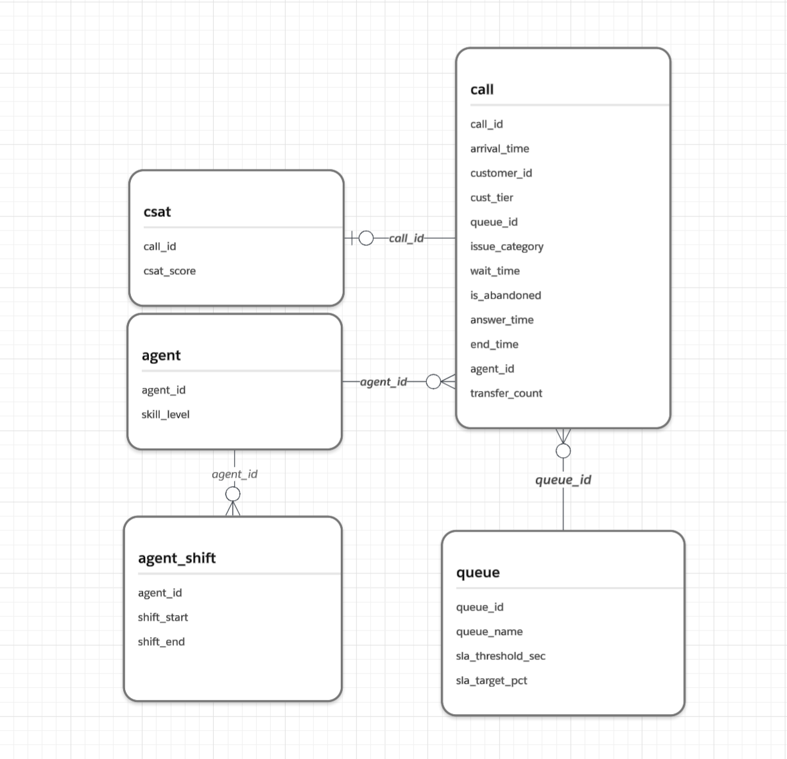
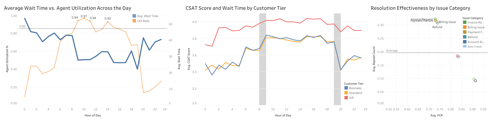
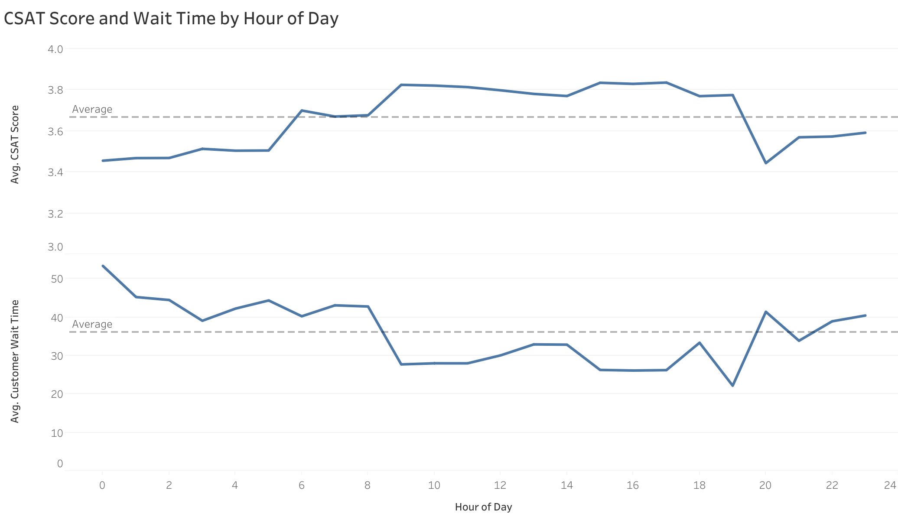
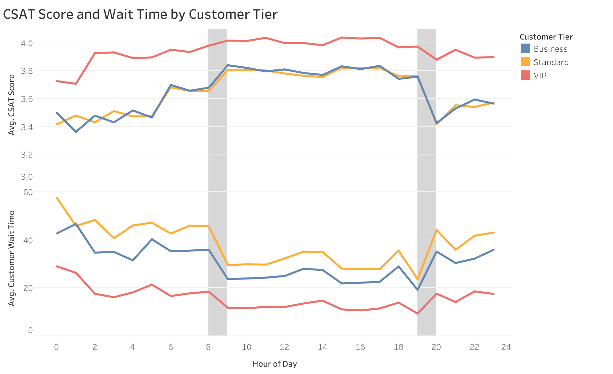
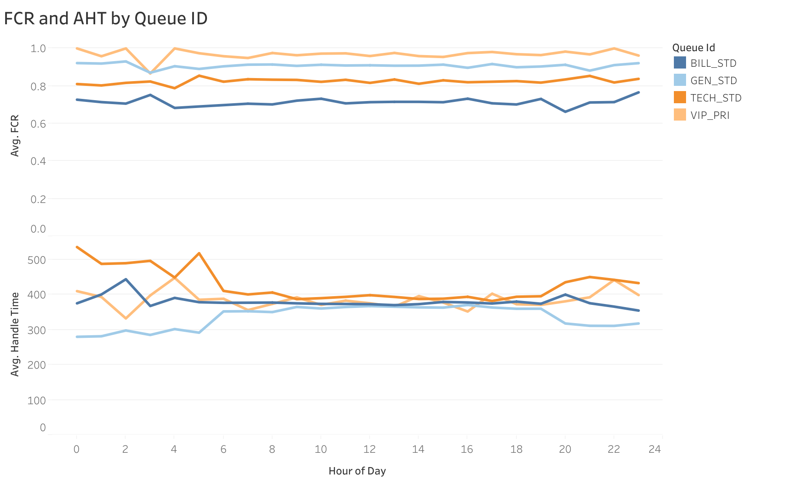
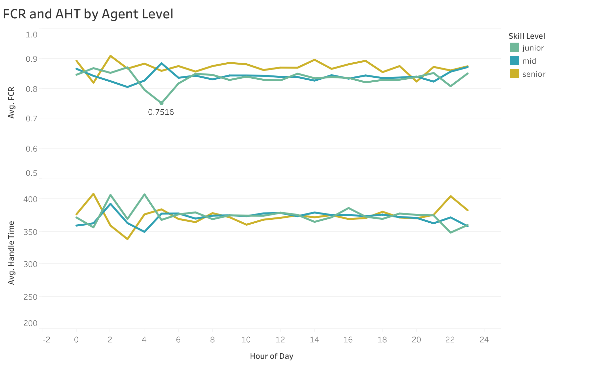
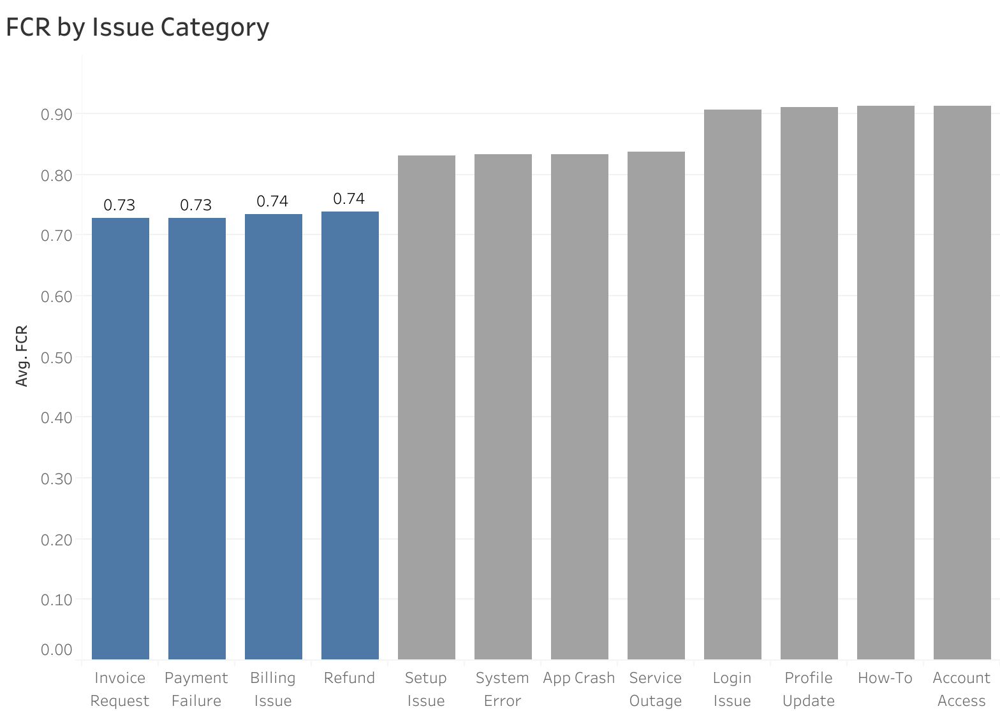
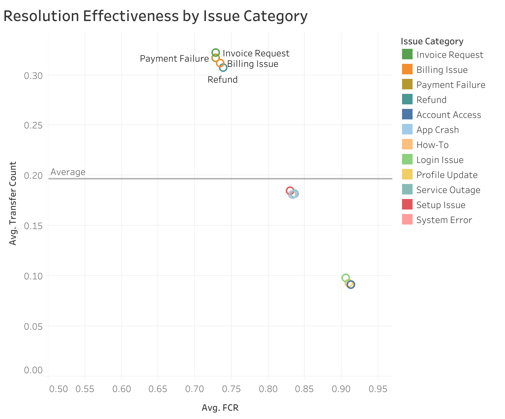
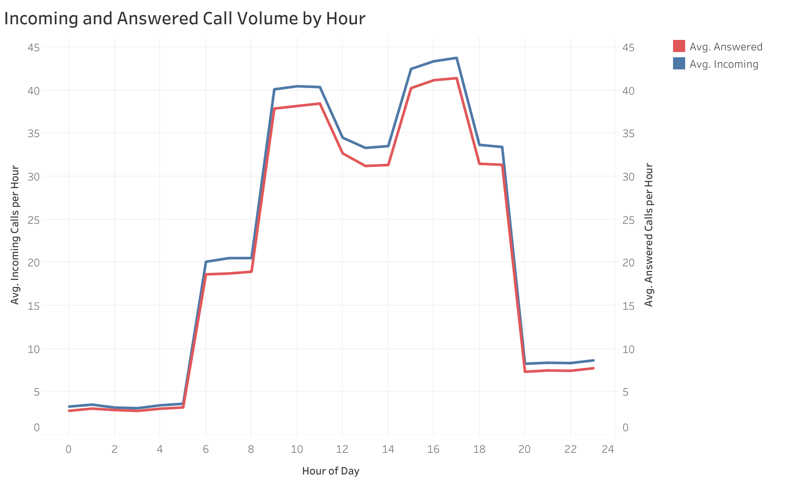
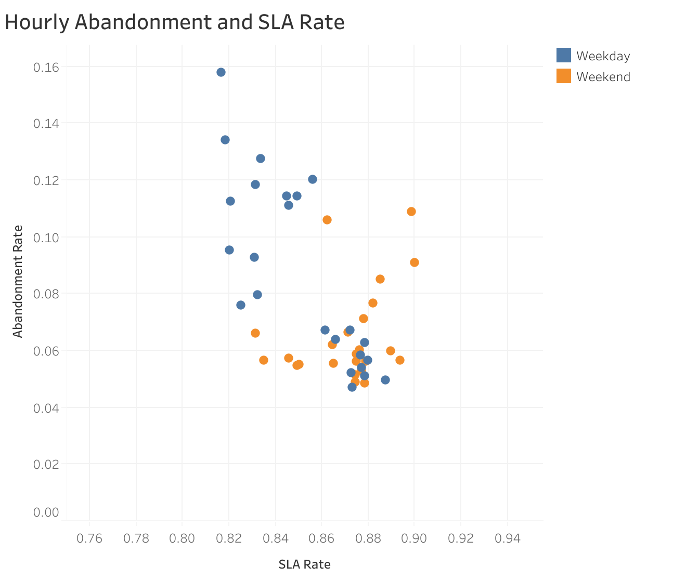

# Client Background

**QueueFlow** is a US-based SaaS company that provides a cloud-based software platform to a growing customer base.

QueueFlow serves approximately 35,000 active customers and handled over **90k inbound customer support calls** over the past six months. These calls span multiple support queues corresponding to different issue types and customer tiers, each governed by defined service-level agreements (SLAs). The available data includes previously underutilized detailed call logs, agent staffing schedules, queue configurations, and post-call customer satisfaction surveys. The objective of this analysis is to identify operational risks driven by demand variability and to provide data-driven recommendations to improve service reliability and efficiency.

Reporting to the **Head of Operations**, this analysis focuses on insights across the following key areas:

### North Star Metrics

**Customer Experience Outcomes** – Analyzing wait times, abandonment rates, and CSAT across queues, customer tiers, and issue categories to understand how operational performance
impacts customer satisfaction.

**Service Quality & Agent Effectiveness** – Measuring agent productivity and service quality using average handle time, utilization, occupancy, and first-contact resolution to ensure efficient and sustainable service delivery.

**Demand & Capacity Health** – Evaluating call inflow, throughput, and capacity risk to assess whether operational resources are sufficient to meet demand.

An interactive Tableau dashboard used to report and explore sales trends can be found here [link].

# Data Structure & Initial Checks

The companies main database structure as seen below consists of four tables: call , agent, agent_shift, queue, csat a total row count of X records. A description of each table is as follows:

# Executive Summary

### Overview of Findings

During off-peak hours, wait times become longer and more inconsistent even though agent utilization is low and throughput keeps pace with arrivals, suggesting inefficiencies in staffing or skill coverage rather than a lack of capacity. Because VIP customers are prioritized, Business and Standard tiers absorb most system fluctuations and account for the majority of CSAT variability. Technical and Billing queues consistently show lower CSAT and FCR along with higher repeat rates, indicating that issue complexity and resolution challenges, not service speed alone, drive inefficiency.

# Insights Deep Dive
### Customer Experience Outcomes:
#### 1. CSAT Peaks During Midday Low-Friction Periods
- CSAT scores reach their highest levels during standard service hours (≈3.70–3.80), coinciding with the lowest average wait times (≈25–30 seconds).
- This suggests that reduced service friction is a key driver of improved customer experience.
#### 2. Clear Prioritization of VIP Customers Drives Tier-Level CSAT Gaps
- VIP customers maintain consistently higher and more stable CSAT across all hours (≈3.8–4.0), while Business and Standard tiers show lower scores and greater volatility (≈3.4–3.8).
- VIPs experience  shorter and more stable waits (≈10–30s), while Standard and Business customers face longer and more variable wait times (≈25–60s).
- Standard and Business experience ~1–1.5× larger during fluctuating periods,  indicating that VIP customers are less exposed to system-level volatility.
- Because Business and Standard tiers drive most CSAT volatility, QueueFlow may need to focus on stabilizing experience for these groups to improve overall CSAT.
#### 3. Issue Complexity Drives Lower CSAT in Technical and Billing Queues
- Technical and Billing queues show persistently lower CSAT than General inquiries at similar wait times (~9–19) , indicating that issue complexity contributes to satisfaction gaps beyond service delays.

### Service Quality & Agent Effectiveness:
#### 1. Inefficiency Is Concentrated in Bill and Tech Calls 
- Billing and Technical calls show lower First Call Resolution (FCR) (≈0.7–0.8) and higher Average Handle Time (AHT) (≈400–500s) during early non-peak hours.
- The Technical queue exhibits the highest AHT volatility, with largest swings of (≈25%), suggesting service instability outside of core hours. 
#### 2. FCR Remains Stable
- FCR remains consistently high across hours and agent skill (≈0.82–0.90), indicating that resolution quality is largely insensitive to time of day.
- An isolated FCR dip (~0.75) occurs for  the junior at a specific hour without a corresponding spike in AHT.
- Average Handle Time (AHT) shows limited variation (≈350–380s) and does not exhibit a strong inverse relationship with FCR, suggesting that longer calls are not the primary driver of resolution outcomes.
#### 3. Low-FCR Issues Also Drive the Highest Repeat Burden
- Billing Issues, Payment Failures, and Refunds post the lowest FCR rates (≈0.73–0.74) while generating the highest average transfer counts (≈0.30–0.33), significantly above the overall average of 0.20. 
- Categories such as Account Access, How-To, and Profile Update achieve FCR above 0.90 and maintain low repeat burden (≈0.09–0.10).
- Low-FCR issues, especially in the billing category, generate disproportionate repeat workload,  pointing to resolution gaps within billing workflows.

### Demand & Capacity Hea;th:
#### 1. Throughput Scales with Hourly Arrivals
- Throughput and Arrivals have the same intraday, suggesting that operational resources are scaled with arrival inputs. 
- Consistent gaps of 2–5 calls per hour suggests the system is structurally able to meet demand at scale, with a small, predictable level of call loss rather than episodic congestion.
#### 2. Negative Relationship Between SLA and Abandonment Rate During Weekdays
- Weekday hours exhibit a wider spread of SLA performance, with abandonment rates declining as SLA improves.
- Weekend observations are highly clustered at high SLA (≈0.87–0.90) with low abandonment (≈5–7%), with few intermediate states.
- This suggests that weekday performance degrades more gradually, while weekend performance tends to operate in discrete service states. 
#### 3. Agent Utilization Does Not Fully Explain Service Experience
- During peak hours, agent utilization rate clusters near capacity (≈0.85–0.95), frequently approaching or exceeding the 0.85 threshold, while average wait time remains stable and low.
- Early morning and late evening hours show lower utilization of less than 0.5, yet wait times remain inconsistent and longer.

# Recommendations:

Based on the insights and findings above, we would recommend the [stakeholder team] to consider the following: 

* Specific observation that is related to a recommended action. **Recommendation or general guidance based on this observation.**
  
* Specific observation that is related to a recommended action. **Recommendation or general guidance based on this observation.**
  
* Specific observation that is related to a recommended action. **Recommendation or general guidance based on this observation.**
  
* Specific observation that is related to a recommended action. **Recommendation or general guidance based on this observation.**
  
* Specific observation that is related to a recommended action. **Recommendation or general guidance based on this observation.**
  
